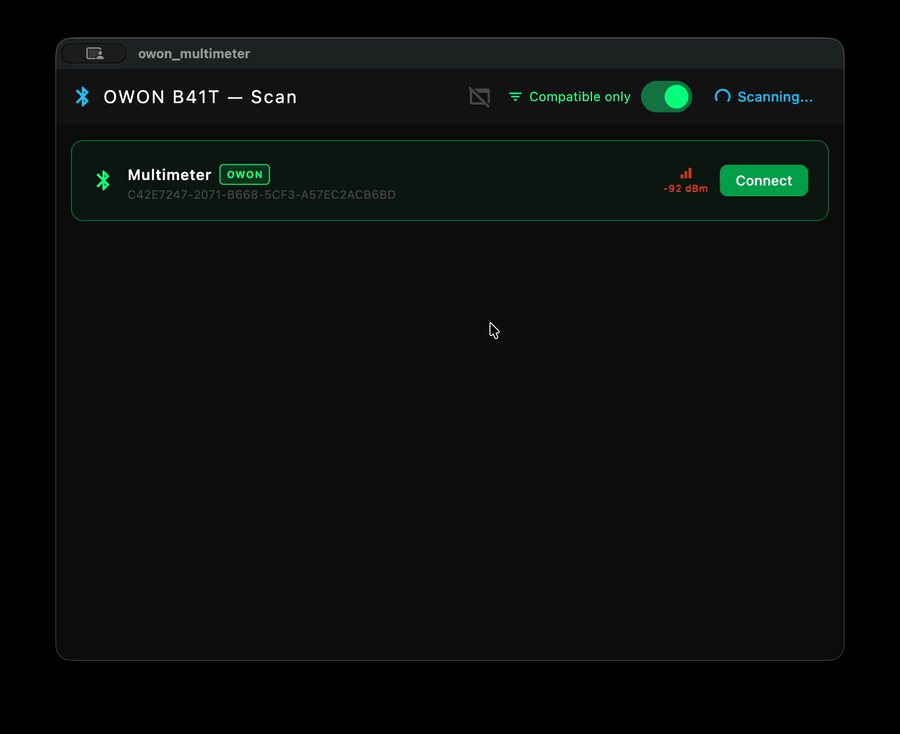

<div align="center">



<br/>

# Multimeter GUI for OWON B41T+

**A native desktop companion for the OWON B41T+ Bluetooth multimeter.**

[](https://flutter.dev)
[](https://github.com)
[](https://github.com)
[](https://github.com)
[](LICENSE)

</div>

---

## Overview

Connect your **OWON B41T+** multimeter over Bluetooth and get a live readout on your desktop — complete with measurement history, a trend chart, and hardware button controls. No drivers, no proprietary software.

---

## Features

<table>
<tr>
<td width="50%">

### 📡 BLE Scanner
Discovers nearby BLE devices and highlights OWON-compatible ones. Filter toggle keeps the list clean. Tap once to connect.

### ⚡ Live Measurement
Large real-time display with measurement function (V DC/AC, A, Ω, Hz, F, °C, °F, Diode, Continuity, hFE, NCV, Duty Cycle), scale prefix, and unit.

### 🏷 Status Badges
Visual indicators for **HOLD**, **REL**, **AUTO**, **BAT**, **MIN**, **MAX**, and **OL** (overload) — styled to match the physical display.

</td>
<td width="50%">

### 🎛 Hardware Controls
On-screen buttons mirror the physical multimeter: `HOLD` · `REL` · `RANGE` · `Hz` · `MAX` · `SELECT`. Commands are sent over BLE.

### 📈 History Chart
Animated line graph of recent measurements with glow effect, grid lines, and min/max labels.

### 📋 Console Log
Scrollable timestamped log of every reading. Auto-scrolls to new entries unless you've scrolled up — resume with the play button.

### 📊 Session Stats
Live **Min / Average / Max** statistics panel updated with every new reading.

</td>
</tr>
</table>

---

## Requirements

| Platform | Minimum Version |
|----------|----------------|
| macOS | 10.15 Catalina |
| Windows | Windows 10 |
| Linux | Ubuntu 20.04+ (BlueZ required) |

> **Bluetooth** must be enabled. On Linux, the `bluetooth` service must be running (`sudo systemctl start bluetooth`).

---

## Installation

Download the latest release for your platform from the [**Releases**](../../releases) page.

| Platform | File |
|----------|------|
| macOS | `multimeter-gui-macos.zip` → unzip → drag to Applications |
| Windows | `multimeter-gui-windows.zip` → unzip → run `multimeter_gui.exe` |
| Linux | `multimeter-gui-linux.tar.gz` → extract → run `./bundle/multimeter_gui` |

> **macOS note:** The app is unsigned. On first launch go to **System Settings → Privacy & Security** and click **Open Anyway**.

---

## Build from Source

```bash
# Prerequisites: Flutter 3.11+, platform toolchain (Xcode / VS / GCC)
git clone https://github.com/your-username/owon.git
cd owon
flutter pub get

# Pick your platform:
flutter build macos --release
flutter build windows --release
flutter build linux --release
```

Linux also needs:
```bash
sudo apt-get install libgtk-3-dev libbluez-dev libdbus-1-dev
```

---

## Device Protocol

The app communicates with the multimeter over BLE using these characteristics:

| Role | UUID | Direction |
|------|------|-----------|
| Service | `0xFFF0` | — |
| Measurements | `0xFFF4` | Notify (6 bytes per reading) |
| Button commands | `0xFFF3` | Write |
| Device rename | `0xFFF1` | Write |

---

## Keyboard Shortcuts

| Action | macOS | Windows / Linux |
|--------|-------|-----------------|
| Zoom in | `⌘ =` | `Ctrl =` |
| Zoom out | `⌘ -` | `Ctrl -` |
| Reset zoom | `⌘ 0` | `Ctrl 0` |

---

## Colour Palette

<table>
<tr>
<td></td><td><code>#00FF88</code></td><td>Green — live readings, active states</td>
</tr>
<tr>
<td></td><td><code>#00C8FF</code></td><td>Cyan — secondary accent, AC mode, controls</td>
</tr>
<tr>
<td></td><td><code>#FFCC00</code></td><td>Yellow — HOLD / REL flags, average stat</td>
</tr>
<tr>
<td></td><td><code>#FF6600</code></td><td>Orange — BAT flag, max stat</td>
</tr>
<tr>
<td></td><td><code>#FF4444</code></td><td>Red — overload, errors</td>
</tr>
<tr>
<td></td><td><code>#0D0D0D</code></td><td>Background — main surface</td>
</tr>
</table>

---

## License

MIT © Luis Santos

---

## Disclaimer

This project is not affiliated with, endorsed by, or in any way associated with OWON Technology Inc. or any of its subsidiaries. OWON and B41T+ are trademarks or registered trademarks of their respective owners. All product names, logos, and brands are property of their respective owners and are used here for identification purposes only.
